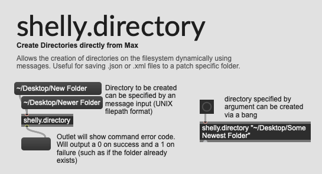
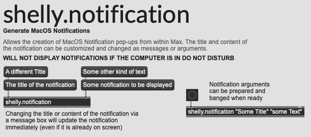
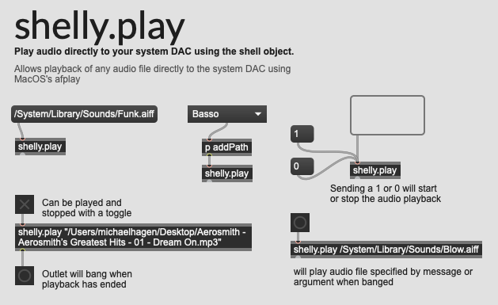
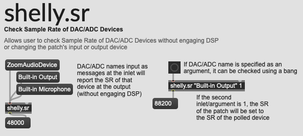
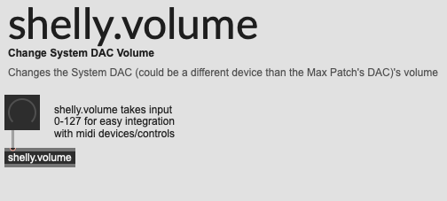

# Shelly
A Max/MSP Package Library of simple wrappers for the shell external object.

Gives users not profficient with shell commands or scripting access to usefull system functions in the form of modular max objects (subpatches).

Includes:
- [shelly.directory](#shellydirectory): Create Directories directly from Max
- [shelly.notification](#shellynotification): Generate MacOS Notifications
- [shelly.play](#shellyplay): Play audio directly to your system DAC using the shell object
- [shelly.sr](#shellysr): Check Sample Rate of DAC/ADC Devices
- [shelly.volume](#shellyvolume): Change System DAC Volume
- and [Jeremy Bernstein and Bill Orcutt's Incredible Shell Object](https://github.com/jeremybernstein/shell), which enables the 5 wrappers.

## Installation
1. Download the zip file from the [releases page](https://github.com/michaelphagen/Shelly/releases).
2. Unzip the file and place the folder in your Max Library directory (either `~/Documents/Max 7 or 8/Library` or `/Users/Shared/Max 7 or 8/Packages`).

# Modules
# shelly.directory

 Create Directories directly from Max. The directory can be specifified as an an argument or a message box input to the module.
# shelly.notification

Generate MacOS Notifications. The notification title and message can both be specified as arguments or message box inputs to the module. The notifications will be hidden if the user is in do-not-disturb mode.
# shelly.play

Play audio directly to your system DAC using the shell object. Supports any format that afplay supports, including:
- .3gp
- .aac
- .aiff
- .aif
- .m4a
- .ec3
- .flac
- .mpeg
- .mp3
- .mp4
- .au
- .wav
# shelly.sr

Check Sample Rate of DAC/ADC Devices. The module takes a string input of the device name and outputs the sample rate.
# shelly.volume

Change System DAC Volume. The module takes an integer from 0-127 for easy mapping to a slider or dial.